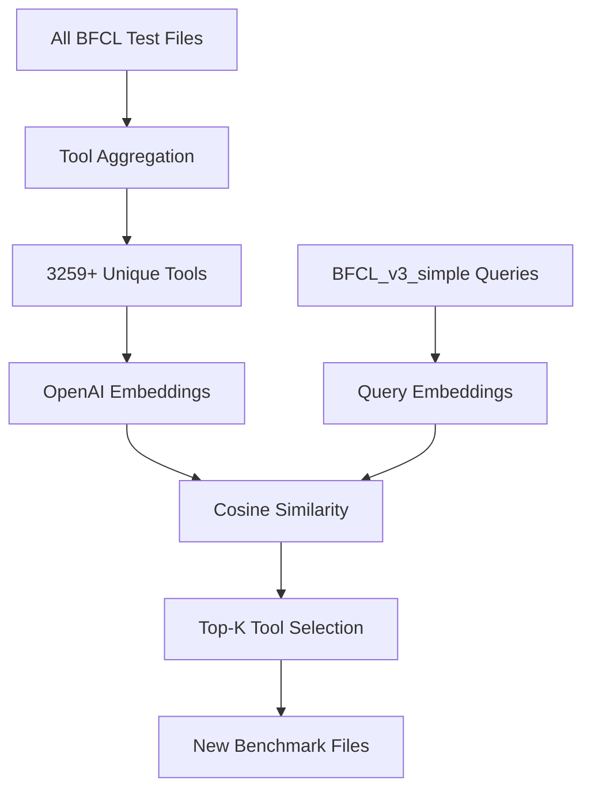

# Tool Scaling Benchmark

## Overview

The Tool Scaling Benchmark is a new addition to the Berkeley Function Calling Leaderboard (BFCL) that evaluates how well language models perform function calling when presented with a large number of available tools. This benchmark addresses the real-world scenario where models need to select and use the most appropriate tools from a vast collection of available functions.

## Key Features

### 1. Comprehensive Tool Aggregation
- **3259+ unique tools** aggregated from ALL existing BFCL test files
- Tools from simple, parallel, multiple, java, javascript, live, and multi-turn datasets
- Covers diverse domains: mathematics, geometry, string manipulation, data processing, etc.

### 2. Semantic Tool Selection
- Uses **OpenAI text-embedding-3-large** for computing tool embeddings
- **Cosine similarity** to rank tools by relevance to each query
- **Intelligent caching** to avoid recomputing embeddings (saves cost and time)

### 3. Configurable Tool Counts
- **tool_scaling_5**: 5 most relevant tools per query
- **tool_scaling_10**: 10 most relevant tools per query  
- **tool_scaling_20**: 20 most relevant tools per query
- **tool_scaling_50**: 50 most relevant tools per query
- **tool_scaling_128**: 128 most relevant tools per query (default)

### 4. Based on BFCL_v3_simple
- Uses the same 400 queries from `BFCL_v3_simple.json`
- Maintains compatibility with existing evaluation infrastructure
- Enables direct comparison with original simple benchmark

## How It Works



1. **Tool Aggregation**: Collect all unique tools from existing BFCL datasets
2. **Embedding Computation**: Generate embeddings for tools and queries using OpenAI API
3. **Similarity Ranking**: Calculate cosine similarity between each query and all tools
4. **Top-K Selection**: Select the K most similar tools for each query
5. **Benchmark Generation**: Create new test files with selected tools

## Installation & Setup

### Prerequisites
```bash
# Install required dependencies
pip install openai scikit-learn tqdm numpy

# Set OpenAI API key
export OPENAI_API_KEY="your-openai-api-key"
```

### Generate Benchmarks
```bash
cd berkeley-function-call-leaderboard

# Generate different tool scaling benchmarks
python bfcl_eval/scripts/tool_scaling_benchmark_efficient.py --num_tools 5
python bfcl_eval/scripts/tool_scaling_benchmark_efficient.py --num_tools 10
python bfcl_eval/scripts/tool_scaling_benchmark_efficient.py --num_tools 20
python bfcl_eval/scripts/tool_scaling_benchmark_efficient.py --num_tools 50
python bfcl_eval/scripts/tool_scaling_benchmark_efficient.py --num_tools 128
```

## Usage with BFCL

### 1. Generate Model Responses
```bash
# Test with 128 tools (default)
python -m bfcl_eval generate --model your_model --test_category tool_scaling_128

# Test with different tool counts
python -m bfcl_eval generate --model your_model --test_category tool_scaling_5
python -m bfcl_eval generate --model your_model --test_category tool_scaling_10

# Test all tool scaling benchmarks
python -m bfcl_eval generate --model your_model --test_category tool_scaling
```

### 2. Evaluate Results
```bash
python -m bfcl_eval evaluate --model your_model --test_category tool_scaling_128
```

### 3. View Scores
```bash
python -m bfcl_eval scores
```

## Example Results

### Query: "Find the area of a triangle with a base of 10 units and height of 5 units."

**Top 5 Most Similar Tools:**
1. `calculate_triangle_area` - Calculate the area of a triangle given its base and height
2. `geometry.area_triangle` - Calculate the area of a triangle  
3. `calc_area_triangle` - Calculate the area of a triangle with formula area = 0.5 * base * height
4. `calculate_area` - Calculate the area of a right-angled triangle
5. `geometry.triangle_area` - Calculate triangle area using base and height

### Query: "Calculate the factorial of 5 using math functions."

**Top 5 Most Similar Tools:**
1. `math.factorial` - Calculate the factorial of a given number
2. `calculate_factorial` - Calculate the factorial of a given number
3. `math.factorial` - Calculate the factorial of a given positive integer
4. `factorial_calculation` - Compute factorial of an integer
5. `math_operations.factorial` - Calculate factorial using math operations

## Benchmark Statistics

| Tool Count | File Size | Total Tools Available | Avg Tools per Query |
|------------|-----------|----------------------|-------------------|
| 5          | 1.1 MB    | 3259                 | 5                 |
| 10         | 2.3 MB    | 3259                 | 10                |
| 20         | 4.5 MB    | 3259                 | 20                |
| 50         | 11.7 MB   | 3259                 | 50                |
| 128        | 31.8 MB   | 3259                 | 128               |

## Research Applications

### 1. Tool Scaling Studies
- Evaluate how model performance changes with tool count
- Identify optimal tool set sizes for different query types
- Study tool selection strategies and ranking effectiveness

### 2. Semantic Understanding
- Test model ability to understand tool relevance
- Evaluate semantic matching between queries and tool descriptions
- Study impact of tool description quality on selection

### 3. Real-World Scenarios
- Simulate environments with large tool collections
- Test model behavior with distractors and irrelevant tools
- Evaluate robustness to tool set composition

## Technical Details

### Embedding Model
- **Model**: `text-embedding-3-large` (OpenAI)
- **Dimensions**: 3072
- **Context Length**: 8191 tokens

### Tool Representation
Tools are converted to text using this format:
```
Function: {name}
Description: {description}
Parameters:
- {param_name} ({type}): {description}
```

### Caching Strategy
- Tool embeddings cached by MD5 hash of tool definition
- Query embeddings cached by MD5 hash of query text
- Persistent storage in `embeddings_cache/` directory
- Automatic cache loading/saving for efficiency

### Performance Optimizations
- **Batched API calls** (default batch size: 50)
- **Vectorized similarity computation** using NumPy
- **Efficient sorting** with NumPy argsort
- **Rate limiting** with automatic delays

## Files Generated

```
bfcl_eval/data/
├── BFCL_v3_tool_scaling_5.json      # 5 tools per query
├── BFCL_v3_tool_scaling_10.json     # 10 tools per query  
├── BFCL_v3_tool_scaling_20.json     # 20 tools per query
├── BFCL_v3_tool_scaling_50.json     # 50 tools per query
└── BFCL_v3_tool_scaling_128.json    # 128 tools per query

bfcl_eval/data/embeddings_cache/
├── tool_embeddings_efficient.pkl     # Cached tool embeddings
├── query_embeddings_efficient.pkl    # Cached query embeddings
└── vectorizer_mock.pkl               # Mock vectorizer (if used)
```

## Cost Estimation

### OpenAI API Costs (text-embedding-3-large)
- **Tool embeddings**: ~3259 tools × $0.00013/1K tokens ≈ $1.30
- **Query embeddings**: ~400 queries × $0.00013/1K tokens ≈ $0.16
- **Total first run**: ~$1.46
- **Subsequent runs**: $0 (cached)

## Limitations

1. **Embedding Quality**: Results depend on OpenAI embedding model quality
2. **Static Tool Set**: Tools are fixed at benchmark generation time
3. **English Only**: Currently optimized for English tool descriptions
4. **Semantic Bias**: May favor tools with similar description patterns

## Future Enhancements

1. **Dynamic Tool Selection**: Runtime tool selection based on query analysis
2. **Multi-language Support**: Support for non-English tool descriptions  
3. **Custom Embedding Models**: Support for other embedding providers
4. **Tool Clustering**: Group similar tools to reduce redundancy
5. **Difficulty Levels**: Create easy/medium/hard variants based on tool similarity

## Contributing

To add new tool scaling configurations:

1. Update `category_mapping.py`:
```python
"tool_scaling_256": f"{VERSION_PREFIX}_tool_scaling_256.json",
```

2. Add to test collection:
```python
"tool_scaling": [
    # ... existing entries ...
    "tool_scaling_256",
],
```

3. Generate benchmark:
```bash
python bfcl_eval/scripts/tool_scaling_benchmark_efficient.py --num_tools 256
```

## Citation

If you use the Tool Scaling Benchmark in your research, please cite:

```bibtex
@misc{tool_scaling_benchmark_2024,
  title={Tool Scaling Benchmark: Evaluating Function Calling with Large Tool Sets},
  author={Berkeley Function Calling Leaderboard Team},
  year={2024},
  url={https://github.com/ShishirPatil/gorilla/tree/main/berkeley-function-call-leaderboard}
}
```

## License

This benchmark is released under the same license as the Berkeley Function Calling Leaderboard.